# A Quick Introduction to Pd-Lua

Albert Gräf \<<aggraef@gmail.com>\>  
Computer Music Dept., Institute of Art History and Musicology  
Johannes Gutenberg University (JGU) Mainz, Germany  
September 2024

This document is licensed under [CC BY-SA 4.0](https://creativecommons.org/licenses/by-sa/4.0/). Other formats: [Markdown](https://github.com/agraef/pd-lua/blob/master/tutorial/pd-lua-intro.md) source, [PDF](https://agraef.github.io/pd-lua/tutorial/pd-lua-intro.pdf)  
Permanent link: <https://agraef.github.io/pd-lua/tutorial/pd-lua-intro.html>

## Why Pd-Lua?

Pd's facilities for data structures, iteration, and recursion are somewhat limited, thus sooner or later you'll probably run into a problem that can't be easily solved by a Pd abstraction any more. At this point you'll have to consider writing an external object (or just *external*, for short) in a "real" programming language instead. Pd externals are usually programmed using C, the same programming language that Pd itself is written in. But novices may find C difficult to learn, and the arcana of Pd's C interface may also be hard to master.

Enter Pd-Lua, the Pd programmer's secret weapon, which lets you develop your externals in the [Lua](https://www.lua.org/) scripting language. Pd-Lua was originally written by Claude Heiland-Allen and has since been maintained by a number of other people in the Pd community. Lua, from [PUC Rio](http://www.puc-rio.br/), is open-source (under the MIT license), mature, very popular, and supported by a large developer community. It is a small programming language, but very capable, and is generally considered to be relatively easy to learn. For programming Pd externals, you'll also need to learn a few bits and pieces which let you interface your Lua functions to Pd, as explained in this tutorial, but programming externals in Lua is still quite easy and a lot of fun. Using Pd-Lua, you can program your own externals ranging from little helper objects to full-blown synthesizers, sequencers, and algorithmic composition tools. It gives you access to Pd arrays and tables, as well as a number of other useful facilities such as clocks and receivers, which we'll explain in some detail. Pd-Lua also ships with a large collection of instructive examples which you'll find helpful when exploring its possibilities.

Pd-Lua was originally designed for control processing, so we used to recommend [Faust](https://faust.grame.fr/) for doing dsp instead. We still do, but Faust isn't for everyone; being a purely functional language, Faust follows a paradigm which most programmers aren't very familiar with. Fortunately, thanks to the work of Timothy Schoen, the most recent Pd-Lua versions now also provide support for signal processing and even graphics. So it is now possible to create pretty much any kind of Pd object in Lua, including dsp objects. (However, Faust will almost certainly execute dsp code much more efficiently than Pd-Lua, as it generates highly optimized native code for just this purpose.)

Note that we can't possibly cover Pd or the Lua language themselves here, so you'll have to refer to other online resources to learn about those. In particular, check out the Lua website, which has extensive [documentation](https://www.lua.org/docs.html) available, and maybe have a look at Derek Banas' [video tutorial](https://www.youtube.com/watch?v=iMacxZQMPXs) for a quick overview of Lua. For Pd, we recommend the Pd FLOSS Manual at https://flossmanuals.net/ to get started.

## Installation

Pd-Lua works inside any reasonably modern Pd flavor. This encompasses vanilla [Pd](http://msp.ucsd.edu/software.html), of course, but also [Purr Data](https://agraef.github.io/purr-data/) which includes an up-to-date version of Pd-Lua for Lua 5.4 and has it enabled by default, so you should be ready to go immediately; no need to install anything else. The same is true for [plugdata](https://plugdata.org/) (version 0.6.3 or later), a Pd flavor which can also run as a plug-in inside a DAW.

With vanilla Pd, you can install the pdlua package from Deken. There's also an official [Debian](https://salsa.debian.org/multimedia-team/pd/pd-lua) package, maintained by IOhannes Zmölnig. You can also compile Pd-Lua from source, using the author's [Github repository](https://github.com/agraef/pd-lua). Compilation instructions are in the README, and you'll also find some Mac and Windows binaries there. In either case, after installing Pd-Lua you also have to add `pdlua` to Pd's startup libraries.

If all is well, you should see a message like the following in the Pd console (note that for vanilla Pd you'll have to switch the log level to 2 or more to see that message):

~~~
pdlua 0.12.4 (GPL) 2008 Claude Heiland-Allen, 2014 Martin Peach et al.
pdlua: compiled for pd-0.55 on Aug 24 2024 00:51:01
Using lua version 5.4
~~~

This will also tell you the Lua version that Pd-Lua is using, so that you can install a matching version of the stand-alone Lua interpreter if needed. Lua should be readily available from your package repositories on Linux, and for Mac and Windows you can find binaries on the Lua website. In the following we generally assume that you're using Lua 5.3 or later (using Lua versions older than 5.3 is not recommended).

If all is not well and you do *not* see that message, then most likely Pd-Lua refused to load because the Lua library is missing. This shouldn't happen if you installed Pd-Lua from a binary package, but if it does then you may have to manually install the right version of the Lua library to make Pd-Lua work. Make sure that you install the package with the Lua *library* in it; on Debian, Ubuntu and their derivatives this will be something like liblua5.4-0.

## A basic example

With that out of the way, let's have a look at the most essential parts of a Lua external. To make an external, say `foo`, loadable by Pd-Lua, you need to put it into a Lua script, which is simply a text file with the right name (which must be the same as the object name, `foo` in this case) and extension (which needs to be `.pd_lua`), so the file name will be `foo.pd_lua` in this example.

Any implementation of an object must always include:

- a call to the `pd.Class:new():register` method which registers the object class with Pd (this should always be the first line of the script, other than comments)

- a definition of the `initialize` method for your object class

Here is a prototypical example (this is the contents of the foo.pd_lua file):

~~~lua
local foo = pd.Class:new():register("foo")

function foo:initialize(sel, atoms)
   return true
end
~~~

Note that in the first line we called `pd.Class:new():register` with the name of the object class as a string, which *must* be the same as the basename of the script, otherwise Pd's loader will get very confused, create the wrong object class, print a (rather cryptic) error message, and won't be able to create the object.

We also assigned the created class (which is represented as a Lua table) to a variable `foo` (which we made local to the script file here, as explained below). We need that variable as a qualifier for the methods of the object class, including `initialize`. You can actually name that variable whatever you want, as long as you use that name consistently throughout the script. This can be useful at times, if the actual class name you chose, as it is known to Pd and set with `pd.Class:new():register` (as well as being the basename of your .pd_lua script), is a jumble of special characters such as `fo:o#?!`, which isn't a valid Lua identifier.

Next comes the `initialize` method, which is implemented as a Lua function, prefixing the method name with the name of the class variable we created above and a colon, i.e., `foo:initialize`. (This *colon syntax* is used for all functions that represent *methods*, which receive the called object as an implicit `self` parameter; please check the section on function definitions in the Lua manual for details.) As a bare minimum, as is shown here, this method *must* return `true`, otherwise the loader will assume that the object creation has failed, and will complain that it couldn't create the object with an error message.

We mention in passing here that Pd-Lua also provides a parameter-less `postinitialize` method which can be used to execute code after the object has been created, but before the object starts processing messages. We'll see an example of this method later.

---

**NOTE:** Pd-Lua runs *all* Lua objects in the same instance of the Lua interpreter. Therefore, as a general guideline, we want to keep the global name space tidy and clean. That's why we made `foo` a local variable, which means that its scope is confined to this single script. Note that this isn't needed for the member variables and methods, as these are securely stowed away inside the object and not accessible from the outside anyway, if the class variable is `local`. But the same caveat applies to all variables and functions in the script file that might be needed to implement the object, so normally you want to mark these as `local`, too (or turn them into member variables and methods, if that seems more appropriate).

We mention in passing that global variables and functions may also have their uses if you need to share a certain amount of global state between different Lua objects. But even then it's usually safer to have the objects communicate with each other behind the scenes using receivers, which we'll explain later.

---

To actually use the object class we just created, Pd needs be able to find our foo.pd_lua file. We'll discuss different approaches in the following section, but the easiest way to achieve this is to just drop foo.pd_lua into the directory that your patch is in (say, `pd-lua` in your home directory). Now we can just create our first `foo` object (hit Ctrl+1, then type the object name `foo`), and we should see something like this:

Hooray, it works! :)) Well, this object doesn't do anything right now, so let's equip it with a single inlet/outlet pair. This is what the `initialize` method is for, so we have to edit that method accordingly.

NB: If you closed the editor already and don't remember where the file is, you can just right-click the object and choose `Open`, which will open the .pd_lua file in your favorite text editor, as configured in your desktop and/or shell environment.

~~~lua
local foo = pd.Class:new():register("foo")

function foo:initialize(sel, atoms)
   self.inlets = 1
   self.outlets = 1
   return true
end
~~~

Note that, as we already mentioned, the `self` variable here is an implicit parameter of any Lua method, which refers to the object itself. Every Pd-Lua object has two member variables `inlets` and `outlets` which let us specify the number of inlets and outlets our object should have. This needs to be done when the object is initialized; afterwards, the number of inlets and outlets is set in stone and can't be changed any more.

Next, we have to make sure that Pd picks up our edited class definition. Since the Pd-Lua loader will never reload the .pd_lua file for any given object class during a Pd session, we will have to save the patch, quit Pd, relaunch it and reopen the patch:

So there, we got our single inlet/outlet pair now. To do anything with these, we finally have to add some *message handlers* to our object. Say, for instance, we want to handle a bang message by incrementing a counter and outputting its current value to the outlet. We first have to initialize the counter value in the `initialize` method. As we want each `foo` object to have its own local counter value, we create the counter as a member variable:

~~~lua
function foo:initialize(sel, atoms)
   self.inlets = 1
   self.outlets = 1
   self.counter = 0
   return true
end
~~~

It's not necessary to declare the `self.counter` variable in any way, just give it an initial value and be done with it. Finally, we have to add a method for the bang message, which looks as follows:

~~~lua
function foo:in_1_bang()
   self.counter = self.counter + 1
   self:outlet(1, "float", {self.counter})
end
~~~

We'll dive into the naming conventions for message handlers later, but note that `in_1` specifies the first (and only) inlet and `bang` the kind of message we expect. In the body of the method we increment the `self.counter` value and output its new value on the first (and only) outlet. This is done by the predefined `self:outlet` method which takes three arguments: the outlet number, the (Pd) data type to output, and the output value itself. (In general, it's possible to have multiple values there, e.g., when outputting a list value. Therefore the output value is always specified as a Lua table, hence the curly braces around the float output value.)

Throwing everything together, our Lua external now looks as follows:

~~~lua
local foo = pd.Class:new():register("foo")

function foo:initialize(sel, atoms)
   self.inlets = 1
   self.outlets = 1
   self.counter = 0
   return true
end

function foo:in_1_bang()
   self.counter = self.counter + 1
   self:outlet(1, "float", {self.counter})
end
~~~

So let's relaunch Pd, reload the patch again, and add some GUI elements to test it out:

Note that this is still a very basic example. While the example is complete and fully functional, we have barely scratched the surface here. Pd-Lua also allows you to process an object's creation arguments (employing the `atoms` parameter of the `initialize` method, which we didn't use above), log messages and errors in the Pd console, create handlers for different types of input messages and signals, output data and signals to different outlets, work with Pd arrays, clocks, and receivers, and even do some graphics and live coding. We will dive into each of these topics in the rest of this tutorial.

## Objects and Shortcuts

You may have wondered about the whole `pd.Class:new():register("foo")` thing, why is that so complicated? The answer is that Lua uses *prototypes* (class-less objects) to define object-oriented data structures and their methods. Consequently, Pd-Lua defines a few of these to represent various kinds of Pd objects on the Lua side. There's `pd.Class` which represents Pd object classes, `pd.Table` which is used to access Pd arrays and tables, and `pd.Clock`, `pd.Receive` for Pd's clock and receiver objects.

Each kind of object needs a way to create an instance of the object, that's what the `new()` method is for, and a second method (usually called `register`, but Pd arrays use `sync` instead) which associates the Lua object with its counterpart in Pd. The `register()` method also creates the corresponding data structure in Pd in most cases.

So that's why we first invoke `new()` and then `register()` on the prototype (`pd.Class`, etc.); it's always this two-step process. However, since version 0.12.14, Pd-Lua also provides some convenient *shortcuts*. In the case of `pd.Class:new():register()`, the shortcut is simply `pd.class()`. (Note that `class` is written in all lower-case, while the prototype `pd.Class` has `Class` capitalized -- this may be hard to see in the font we've chosen for this document.)

Thus, we can abbreviate the definition of the `foo` object class in our first example as:

~~~lua
local foo = pd.class("foo")
~~~

Much shorter, and easy to remember. Shortcuts for the other kinds of objects will be introduced along with the long forms in the corresponding sections below. Feel free to use them. But note that in the tutorial and the accompanying examples we generally keep to the long forms, so that our examples will work unchanged with older Pd-Lua versions.

## Where your Lua files go

As already mentioned, the externals (.pd_lua files) themselves can go either into the directory of the patch using the external, or into any other directory on Pd's search path (on Linux, this generally includes, ~/.pd-externals, or  ~/.pd-l2ork-externals when running pd-l2ork or purr-data).

The Lua loader temporarily sets up Lua's `package.path` so that it includes the directory with the external, so you can put any Lua modules (.lua files) required by the external into that directory.

---

**NOTE:** As of Pd-Lua 0.12.5, the same is true for the pdlua external directory, where you can put any Lua modules that should be readily available to all your Pd-Lua objects. One example of this is Pd-Lua's own [pdx.lua](#pdx.lua) live-coding module which we'll discuss later, but it can also be used for general Lua utility modules that you want to use. There are a lot of incredibly useful Lua libraries out there, such as [kikito 's inspect](https://github.com/kikito/inspect.lua) or [lunarmodules' penlight](https://github.com/lunarmodules/Penlight), although you might prefer to install these using [LuaRocks](https://luarocks.org/), Lua's most popular package manager.

---

If you need/want to use Lua libraries from other locations which aren't on the standard Lua `package.path`, then you'll have to set up the `LUA_PATH` environment variable accordingly. LuaRocks usually takes care of this for you when set up properly. Otherwise you can set `LUA_PATH` manually in your system startup files, such as ~/.bashrc or ~/.xprofile on Linux. E.g.:

~~~shell
export LUA_PATH=~/lua/'?.lua;;'
~~~

Note that `?` is a placeholder for the module name, the semicolon `;` can be used to separate different locations, and a double semicolon `;;` adds Lua's standard search path (make sure that you quote those special characters so that the shell doesn't try to interpret them). You should *always* include the double semicolon somewhere, otherwise the Lua interpreter won't be able to find its standard library modules any more. Also note that you may want to place the `;;` in front of the path instead, if the standard locations are to be searched before your custom ones.

## Creation arguments

Besides the implicit `self` argument, the `initialize` method has two additional parameters:

- `sel`, the selector argument, is a string which contains the Pd name of the object class. You probably won't need this, unless you want to use it for error reporting, or if you have a generic setup function for several related object classes. We won't go into this here.

- `atoms` is a Lua table which contains all the arguments (Pd "atoms", i.e., numbers or strings) an object was created with. `#atoms` gives you the number of creation arguments (which may be zero if none were specified), `atoms[1]` is the first argument, `atoms[2]` the second, and so on. As usual in Lua, if the index `i` runs past the last argument, `atoms[i]` returns `nil`.

For instance, let's say that we want to equip our `foo` object with an optional creation argument, a number, to set the initial counter value. This can be done as follows:

~~~lua
function foo:initialize(sel, atoms)
   self.inlets = 1
   self.outlets = 1
   if type(atoms[1]) == "number" then
      self.counter = atoms[1]
   else
      self.counter = 0
   end
   return true
end
~~~

Here we check that the first creation argument is a number. In that case we use it to initialize the `counter` member variable, otherwise a default value of 0 is set. Note that if there is no creation argument, `atoms[1]` will be `nil` which is of type `"nil"`, in which case the zero default value will be used.

Note that currently our `bang` handler outputs the value *after* incrementing it, which seems a bit awkward now that we can actually specify the counter's start value. Let's rework that method so that it spits out the *current* value before incrementing it:

~~~lua
function foo:in_1_bang()
   self:outlet(1, "float", {self.counter})
   self.counter = self.counter + 1
end
~~~

Note that it's perfectly fine to invoke `self:outlet` at any point in the method.

While we're at it, we might as well add an optional second creation argument to specify the step value of the counter. Try doing that on your own, before peeking at the solution below!

Got it? Good. Here is our final script:

~~~lua
local foo = pd.Class:new():register("foo")

function foo:initialize(sel, atoms)
   self.inlets = 1
   self.outlets = 1
   if type(atoms[1]) == "number" then
      self.counter = atoms[1]
   else
      self.counter = 0
   end
   if type(atoms[2]) == "number" then
      self.step = atoms[2]
   else
      self.step = 1
   end
   return true
end

function foo:in_1_bang()
   self:outlet(1, "float", {self.counter})
   self.counter = self.counter + self.step
end
~~~

That was easy enough. If you've been following along, you also know by now how to reload the patch and add a few bits to test the new features. For instance: 

## Log messages and errors

As soon as your objects get more complicated, you'll probably want to add some messages indicating to the user (or yourself) what's going on inside the object's methods. To these ends, Pd-Lua provides the following two facilities which let you output text messages to the Pd console:

- `pd.post(msg)` outputs the string `msg` to the console on a separate line. You can also post multi-line messages by embedding newline (`\n`) characters in the `msg` string. This is also frequently used for debugging purposes, e.g., to print out incoming messages or intermediate values that your code calculates.

- `self:error(msg)` reports an error message, given as a string `msg`, to the console. These messages are printed in red, to make them stand out, and you can use the "Find Last Error" menu option to locate the object which reported the error. (In Purr Data it's also possible to just click on the "error" link in the console to locate the object.) Note that `self:error` simply prints the message in a way that ties in with "Find Last Error". It doesn't abort the method that executes it, or have any other grave consequences. Thus you can also use it for debugging purposes, like `pd.post`, if you need to trace the message back to the object it came from.

For instance, let's use these facilities to have our `foo` object post the initial counter value in the `initialize` method, as well as report an error if any of the given creation arguments is of the wrong type. Here is the suitably modified `initialize` method:

~~~lua
function foo:initialize(sel, atoms)
   self.inlets = 1
   self.outlets = 1
   self.counter = 0
   self.step = 1
   if type(atoms[1]) == "number" then
      self.counter = atoms[1]
   elseif type(atoms[1]) ~= "nil" then
      self:error(string.format("foo: #1: %s is of the wrong type %s",
                               tostring(atoms[1]), type(atoms[1])))
   end
   if type(atoms[2]) == "number" then
      self.step = atoms[2]
   elseif type(atoms[2]) ~= "nil" then
      self:error(string.format("foo: #2: %s is of the wrong type %s",
                               tostring(atoms[2]), type(atoms[2])))
   end
   pd.post(string.format("foo: initialized counter: %g, step size: %g",
                         self.counter, self.step))
   return true
end
~~~

And here's how the console log looks like after loading our test patch, and creating an erroneous `foo bad` object:

Note that the `foo bad` object was still created with the appropriate defaults *after* the error message, so the `initialize` method ran through to the end alright. If you *want* the object creation to fail after printing the error message, you only have to add a `return false` statement in the `elseif` branch, after the call to `self:error`. Try it! (Of course, you won't be able to locate the object using the printed error message in this case, since the object wasn't actually created. But "Find Last Error" will still work, since Pd itself will also print a "couldn't create" error message.)

Here's another fun exercise: Let's have `foo` print a welcome message when it first gets invoked. This can be done by adding a variable `init` to the `foo` class itself, which is shared between different object instances, as follows:

~~~lua
foo.init = false
~~~

You should put this after the definition of `foo` (i.e., after the line with the `pd.Class:new()` call), but before any code that uses this variable. Note that we could also just have used an ordinary local variable at script level instead, but this illustrates how you create static class members in Lua.

You still have to add the code which outputs the welcome message. An obvious place for this is somewhere in `initialize`, but here we use the `postinitialize` method for illustration purposes:

~~~lua
function foo:postinitialize()
   if not foo.init then
      pd.post("Welcome to foo! Copyright (c) by Foo software.")
      foo.init = true
   end
end
~~~

This will print the message just once, right after the first `foo` object is created. There's another `finalize` method which can be used to perform any kind of cleanup when an object gets destroyed. For instance, let's rework our example so that it keeps track of the actual number of `foo` objects, and prints an additional message when the last `foo` object is deleted. To these ends, we turn `foo.init` into a counter which keeps track of the number of `foo` objects:

~~~lua
foo.init = 0

function foo:postinitialize()
   if foo.init == 0 then
      pd.post("Welcome to foo! Copyright (c) by Foo software.")
   end
   foo.init = foo.init + 1
end

function foo:finalize()
   foo.init = foo.init - 1
   if foo.init == 0 then
      pd.post("Thanks for using foo!")
   end
end
~~~

Here are the messages logged in the console if we now load our test patch and then go on to delete all `foo` objects in it:

~~~
foo: initialized counter: 0, step size: 1
Welcome to foo! Copyright (c) by Foo software.
foo: initialized counter: 5, step size: 1
foo: initialized counter: 0, step size: 5
Thanks for using foo!
~~~

### Lua errors

We all make mistakes. It's inevitable that you'll run into errors in the Lua code you wrote, so let's finally discuss how those mishaps are handled. Pd-Lua simply reports errors from the Lua interpreter in the Pd console. For instance, suppose that we omitted the `pd` qualifier in the one-time welcome message above, turning `pd.post` into just `post` (quite an easy mistake to make). You'll then see an error message like this in the console:

~~~
error: lua: foo.pd_lua: 29: attempt to call a nil value (global 'post')
error: couldn't create "foo"
~~~

You'll recall that an undefined global like the mistyped `post` symbol above will always yield the `nil` value in Lua, which obviously isn't a function and thus can't be called like one. (Not all error messages will be quite as perspicuous, so a web search may be in order to figure them out.) In this case the error happened in the `postinitialize` method, so the object couldn't actually be created, and you will have to correct the typo before going on. Fortunately, the message tells us exactly where the error occurred, so we can fix it easily.

Syntax errors anywhere in the script file will be caught and handled in a similar fashion.

Runtime errors in inlet methods, on the other hand, will allow your objects to be created and to start executing. They just won't behave as expected and cause a variety of error messages to be printed in the console which might look a bit cryptic at first glance. For instance, let's suppose that you forgot the curly braces around the float value in `self:outlet` (another fairly common error), so that the method reads:

~~~lua
function foo:in_1_bang()
   self:outlet(1, "float", self.counter) -- WRONG!
   self.counter = self.counter + self.step
end
~~~

Lua is a dynamically-typed language, so this little glitch becomes apparent only when you actually send a `bang` message to the object, which causes the following error to be logged in the console:

~~~
error: foo.pd_lua: 41: error: invalid atoms table [outlet 1]
... click the link above to track it down, or click the 'Find Last Error' item in the Edit menu.
~~~

This message actually comes from the C routine deep down in Pd-Lua which checks the arguments of the `outlet` method for validity before it sends any data through the outlet. In this case it took issue with the `atoms` argument. If you see that message, it's a telltale sign that you tried to output an atom not properly wrapped in a Lua table. The message also tells you about the outlet number which caused the issue, and the line number with the definition of the method in which the error happened (which is the `foo:in_1_bang` method in this case). So it's not the *exact* location of the `self:outlet()` call, but still close enough so that you can easily find that spot with the extra information provided in the error message.

To actually fix the error, simply go to the line number from the error message in the editor to find the method with the error, and edit the `outlet` call to add the curly braces around `self.counter` back in. In case you already closed the editor, recall that you can just click on the error message (or use the "Find Last Error" operation) to locate the object, then right-click the object and open it.

## Inlets and outlets

As we've already seen, the number of inlets and outlets is set with the `inlets` and `outlets` member variables in the `initialize` method of an object. You can set these to any numbers you want, including zero. (In the current implementation, fractional numbers will be truncated to integers, and negative numbers will be treated as zero. If the variables aren't set at all, they also default to zero.)

### Inlets

Let's have a look at the inlets first. Pd-Lua supports a number of different forms of inlet methods which enable us to process any kind of Pd message. In the following list, "1" stands for any literal inlet number (counting the inlets from left to right, starting at 1), and "sym" for any symbol denoting either one of the predefined Pd message types (bang, float, symbol, pointer, and list), or any other (selector) symbol at the beginning of a Pd meta message. Note that, as usual, in your code these methods are always prefixed with the class name, using Lua colon syntax.

- `in_1_sym(...)` matches the given type or selector symbol on the given inlet; the method receives zero or one arguments (denoted `...` here), depending on the selector symbol `sym`, see below

- `in_n_sym(n, ...)` (with a verbatim "n" replacing the inlet number) matches the given type or selector symbol on *any* inlet; the actual inlet number is passed as the first argument (denoted `n` here), along with the zero or one extra arguments `...` which, like above, depend on the selector symbol `sym`

- `in_1(sel, atoms)` matches *any* type or selector symbol on the given inlet; the type or selector symbol is passed as a string `sel`, and the remaining arguments of the message are passed as a Lua table `atoms` containing number and string values

- `in_n(n, sel, atoms)` matches *any* type or selector symbol on *any* inlet; the method is invoked with the inlet number `n` along with type/selector symbol `sel` and the remaining message arguments in the Lua table `atoms`

These alternatives are tried in the indicated order, i.e., from most specific to most general. In addition, Pd-Lua understands the following specific `sym` type selectors and adjusts the number and type of the extra `...` arguments accordingly:

- `bang` denotes a bang message and passes no arguments

- `float` denotes a Pd float value, which is passed as a number argument

- `symbol` denotes a Pd symbol, which is passed as a string argument

- `pointer` denotes a Pd pointer, which is passed as a Lua userdata argument

- `list` denotes a Pd list, which is passed as a Lua table argument containing all the list elements

- any other `sym` value is taken as a literal Pd symbol to be matched against the selector symbol of the incoming message; the remaining arguments of the message are passed as a Lua table argument

Note that there can only be zero or one additional arguments in this case (besides the inlet number for `in_n_sym`). In contrast, the two most generic kinds of methods, `in_1` and `in_n`, always have the type/selector symbol `sel` (a string) and the remaining message arguments `atoms` (a Lua table) as arguments.

Among these, the methods for `bang`, `float`, and `list` are probably the most frequently used, along with `in_1` or `in_n` as a catch-all method for processing any other kind of input message. We've already employed the `in_1_bang` method in our basic example above. Here are some (rather contrived) examples for the other methods; we'll see some real examples of some of these later on.

~~~lua
function foo:in_1_float(x)
   pd.post(string.format("foo: got float %g", x))
end

function foo:in_1_symbol(x)
   pd.post(string.format("foo: got symbol %s", x))
end

function foo:in_1_list(x)
   pd.post(string.format("foo: got list %s", table.concat(x, " ")))
end

function foo:in_1_bar(x)
   pd.post(string.format("foo: got bar %s", table.concat(x, " ")))
end

function foo:in_n_baz(n, x)
   pd.post(string.format("foo: got baz %s on inlet #%d",
                         table.concat(x, " "), n))
end

function foo:in_1(sel, atoms)
   pd.post(string.format("foo: got %s %s", sel, table.concat(atoms, " ")))
end

function foo:in_n(n, sel, atoms)
   pd.post(string.format("foo: got %s %s on inlet #%d", sel,
                         table.concat(atoms, " "), n))
end
~~~

(Note that we omitted the pointer type in the above examples, as it is rarely used in Lua externals. But if you want, you can also receive such values, which will be represented as "userdata" a.k.a. C pointers on the Lua side. In Lua 5.4 it is possible to print such values using the `%p` format specifier of `string.format`, while in older Lua versions you will have to use the Lua `tostring()` function for this purpose.)

### Outlets

Luckily, things are much simpler on the output side. As we've already seen, to output a message to an outlet, you simply call `self:outlet(n, sel, atoms)` with the following arguments:

- `n` is the outlet number, counting from left to right, starting at 1

- `sel` is the type or selector symbol of the message; all the usual Pd type symbols that we've already seen above are recognized here as well: `bang`, `float`, `symbol`, `pointer`, `list`

- `atoms` are the remaining arguments of the message as a Lua table containing numbers, pointers and strings, as required by the message

Here are some common examples:

~~~lua
self:outlet(1, "bang", {})
self:outlet(1, "float", {math.pi})
self:outlet(1, "symbol", {"bar"})
self:outlet(1, "list", {1, 2, 3})
self:outlet(1, "fruit", {"apple", "orange", "kiwi"})
~~~

Usually, `self:outlet` will be called in the inlet methods of an object, but you'll also see it in clocks and receivers, which we'll discuss later.

Note that, by convention, most Pd objects handle inlets and outlets in a certain order, namely:

- The *leftmost* inlet is the so-called *hot* inlet which triggers the actual computation and resulting output of an object. Thus in Lua the calls to `self:outlet` should normally be put into the `in_1` methods.

- Consequently, outlets are normally triggered *from right to left*, so that, with a straight (non-crossing) wiring of the patch cables, a connected object gets its hot inlet triggered *last*. In Lua this means that your `self:outlet` calls should be ordered such that the outlet numbers are *decreasing*, not increasing with each call.

You'll also see this guideline being used in the Fibonacci number example in the next section. Let us emphasize again that this is merely a *convention* and thus you're not obliged to follow it, but most built-in and external Pd objects do. Thus if your Lua object works differently for no good reason, then seasoned Pd users will think that it is malfunctioning. There are some rare cases, however, where it's legitimate to deviate from these rules. Consider, for instance, the built-in `timer` object whose *right* inlet is the "hot" one.

## Fibonacci number example

Nobody in their right mind would actually bother to implement counters in Lua, since they're very easy to do directly in Pd. So let's now take a look at a slightly more interesting example, the Fibonacci numbers. It is also instructive to see how surprisingly difficult it is to write this as a Pd abstraction (you should actually give it a try), whereas it is really dead-easy in Lua.

If you know some math or have studied the Golden ratio, then you've probably heard about these. Starting from the pair 0, 1, the next number is always the sum of the two preceding ones: 0, 1, 1, 2, 3, 5, 8, 13, 21, 34, 55, 89, 144, etc. It goes without saying that these numbers grow pretty quickly (with the ratio of successive numbers approaching the Golden ratio). Thus we may want to limit their range, which is also useful if we want to use these numbers in a musical context, e.g., employing them as the basis of MIDI note numbers. One idea which produces both mathematically and musically interesting results is to take the numbers modulo *m*, i.e., just retain their remainders when divided by the given modulus. As these sequences all have a finite range, they must repeat eventually, but they have a surprisingly large period (also known as the *Pisano period* in number theory) even for small values of *m*.

So, without any further ado, here is a Pd-Lua object which calculates the Fibonacci numbers for a given modulus (10 by default, which, as [Wikipedia](https://en.wikipedia.org/wiki/Pisano_period) will tell you, has a Pisano period of 60). We actually compute (and output) the numbers in pairs, since we have to keep track of the pairs anyway in order to compute them efficiently.

~~~lua
local fibs = pd.Class:new():register("fibs")

function fibs:initialize(sel, atoms)
   -- one inlet for bangs and other messages
   self.inlets = 1
   -- two outlets for the numbers in pairs
   self.outlets = 2
   -- intial pair
   self.a, self.b = 0, 1
   -- the modulus can also be set as creation argument
   self.m = type(atoms[1]) == "number" and atoms[1] or 10
   -- make sure that it's an integer > 0
   self.m = math.max(1, math.floor(self.m))
   -- print the modulus in the console, so that the user knows what it is
   pd.post(string.format("fibs: modulus %d", self.m))
   return true
end

function fibs:in_1_bang()
   -- output the current pair in the conventional right-to-left order
   self:outlet(2, "float", {self.b})
   self:outlet(1, "float", {self.a})
   -- calculate the next pair; note that it's sufficient to calculate the
   -- remainder for the new number
   self.a, self.b = self.b, (self.a+self.b) % self.m
end

function fibs:in_1_float(m)
   -- a float input changes the modulus and resets the sequence
   self.m = math.max(1, math.floor(m))
   self.a, self.b = 0, 1
   pd.post(string.format("fibs: modulus %d", self.m))
end

function fibs:in_1_reset()
   -- a reset message just resets the sequence
   self.a, self.b = 0, 1
end
~~~

And here you can see the object running in a little test patch which outputs the two streams of Fibonacci notes to two different MIDI channels. The two streams can be enabled and disabled individually with the corresponding spigots, and you can also change the modulus on the fly.

## Using arrays and tables

Pd's arrays provide an efficient means to store possibly large vectors of float values. These are often used for sample data (waveforms) of a given size (the number of samples), but can also be employed to store copious amounts of numerical control data. Arrays are usually associated with a graphical display (called a *graph*), and Pd's table object lets you create an array along with a graph as a special kind of subpatch.

Pd-Lua provides `pd.Table` to represent array and table data, and a few functions to query and manipulate that data. This comes in handy, e.g., if you want to fill an array with a computed waveform. While Pd has its own corresponding facilities, complicated waveforms are often much easier to create in Lua, which offers a fairly complete set of basic mathematical functions in its standard library, and a whole lot more through 3rd party libraries such as [Numeric Lua](https://github.com/michal-h21/numlua).

Here are the array/table functions provided by Pd-Lua. Note that like in Pd arrays, indices are zero-based and thus range from `0` to `tab:length()-1`.

- `pd.Table:new():sync(name)`, short form: `pd.table(name)`: creates the Lua representation of a Pd array and associates it with the Pd array named `name`. This requires that an array or table of that name already exists (`sync` will *not* create it), otherwise the result is `nil`. You usually assign that value to a local variable (named `tab` below) to refer to it later.

- `tab:length()`: returns the length of `tab` (i.e., the number of samples in it)

- `tab:get(i)`: gets the sample at index `i` from `tab`; returns a number, or `nil` if the index runs past the table boundaries

- `tab:set(i, x)`: sets the sample at index `i` of `tab` to `x` (a number)

- `tab:redraw()`: redraws the graph of `tab`; you should call this once you're finished updating the table

One important point worth mentioning here is that arrays and tables are subject to change at any time in Pd, as they may have their properties changed, be deleted, and recreated with new parameters. This means that you will have to call `pd.Table:new():sync(name)`, assign it to a local variable, and check that value *every* time you want to access the Pd array in a method.

Here is a simple example of a `luatab` object which takes the array name as a creation argument, and generates a waveform of the given frequency whenever a float value is received on the single inlet. After finishing generating the waveform, a bang message is output on the single outlet.

~~~lua
local luatab = pd.Class:new():register("luatab")

function luatab:initialize(sel, atoms)
   -- single inlet for the frequency, bang goes to the single outlet when we
   -- finished generating a new waveform
   self.inlets = 1
   self.outlets = 1
   -- the name of the array/table should be in the 1st creation argument
   if type(atoms[1]) == "string" then
      self.tabname = atoms[1]
      return true
   else
      self:error(string.format("luatab: expected array name, got %s",
                               tostring(atoms[1])))
      return false
   end
end

function luatab:in_1_float(freq)
   if type(freq) == "number" then
      -- the waveform we want to compute, adjust this as needed
      local function f(x)
         return math.sin(2*math.pi*freq*(x+1))/(x+1)
      end
      -- get the Pd array and its length
      local t = pd.Table:new():sync(self.tabname)
      if t == nil then
         self:error(string.format("luatab: array or table %s not found",
                                  self.tabname))
         return
      end
      local l = t:length()
      -- Pd array indices are zero-based
      for i = 0, l-1 do
         -- normalize arguments to the 0-1 range
         t:set(i, f(i/l))
      end
      -- this is needed to update the graph display
      t:redraw()
      -- output a bang to indicate that we've generated a new waveform
      self:outlet(1, "bang", {})
   else
      self:error(string.format("luatab: expected frequency, got %s",
                               tostring(freq)))
   end
end
~~~

And here is a sample patch running the `luatab` object:

In the same vein, the Pd-Lua distribution includes a much more comprehensive example ltabfill.pd_lua, which leverages Lua's `load` function to create a waveform from a user-specified Lua function created dynamically at runtime (instead of being hard-coded into the Lua code, which is what we did above).

## Using clocks

Clocks are used internally in Pd to implement objects which "do things" when a timeout occurs, such as delays, pipes, and metronomes. Pd-Lua exposes this functionality so that objects written in Lua can do the same. The following functions are provided:

- `pd.Clock:new():register(self, method)`, short form `pd.clock(self, method)`: This creates a new clock for the Pd-Lua object `self` which, when it goes off, runs the method specified as a string `method`. Let's say that `method` is `"trigger"`, then `self:trigger()` will be called without arguments when the clock times out. You usually want to assign the result (a `pd.Clock` object) to a member variable of the object (called `self.clock` below), so that you can refer to it later.

- `self.clock:delay(time)`: sets the clock so that it will go off (and call the clock method) after `time` milliseconds

- `self.clock:set(systime)`: sets the clock so that it will go off at the specified absolute `systime` (measured in Pd time units of `pd.TIMEUNITPERMSEC`, see below)

- `self.clock:unset()`: unsets the clock, canceling any timeout that has been set previously

- `self.clock:destruct()`: destroys the clock

---

**NOTE:** Calling `self.clock:destruct()` on a clock that isn't needed any more (in the `finalize` method at the latest) used to be mandatory, and is still possible, but since 0.12.12 it is no longer necessary, as it also happens automatically when the target object gets deleted. This makes it now possible to have one-shot timers like `pd.Clock:new():register(self, "oneshot"):delay(1000)` which aren't assigned to any variable. (This is not recommended, though, if you want to maintain compatibility with earlier Pd-Lua versions.)

---

We mention in passing that you can call `self.clock:delay(time)` as soon as the clock has been created, even in the `initialize` method of an object. Furthermore, you can have as many clocks as you want in the same object, carrying out different actions, as long as you assign each clock to a different method.

Here is a little `tictoc` object we came up with for illustration purposes.

~~~lua
local tictoc = pd.Class:new():register("tictoc")

function tictoc:initialize(sel, atoms)
   -- inlet 1 takes an on/off flag, inlet 2 the delay time
   self.inlets = 2
   -- bangs are output alternating between the two outlets
   self.outlets = 2
   -- the delay time (optional creation argument, 1000 msec by default)
   self.delay = type(atoms[1]) == "number" and atoms[1] or 1000
   -- we start out on the left outlet
   self.left = true
   -- initialize the clock
   self.clock = pd.Clock:new():register(self, "tictoc")
   return true
end

function tictoc:finalize()
  self.clock:destruct()
end

-- As with the metro object, nonzero, "bang" and "start" start the clock,
-- zero and "stop" stop it.

function tictoc:in_1_float(state)
   if state ~= 0 then
      -- output the first tick immediately
      self:tictoc()
   else
      -- stop the clock
      self.clock:unset()
   end
end

function tictoc:in_1_bang()
   self:in_1_float(1)
end

function tictoc:in_1_start()
   self:in_1_float(1)
end

function tictoc:in_1_stop()
   self:in_1_float(0)
end

-- set the delay (always in msec, we don't convert units)

function tictoc:in_2_float(delay)
   -- this will be picked up the next time the clock reschedules itself
   self.delay = delay >= 1 and delay or 1
end

-- the clock method: tic, toc, tic, toc ...

function tictoc:tictoc()
   -- output a bang, alternate between left and right
   self:outlet(self.left and 1 or 2, "bang", {})
   self.left = not self.left
   -- reschedule
   self.clock:delay(self.delay)
end
~~~

And here is the usual test patch:

An explanation of `self.clock:set(systime)` is still in order. In contrast to `self.clock:delay(time)`, this schedules a timeout at the given *absolute* time given in `pd.TIMEUNITPERMSEC` units. This may be preferable in some situations, e.g., if you have to schedule some events that use increasing timestamps instead of delta times. Version 0.12.12 of Pd-Lua adds the `pd.TIMEUNITPERMSEC` constant and some support functions for dealing with these time values:

- `pd.systime()`: Returns the current time in `pd.TIMEUNITPERMSEC` units. You can use this to derive a value for `self.clock:set`'s `systime` argument. For instance, `self.clock:set(pd.systime() + time * pd.TIMEUNITPERMSEC)` is equivalent to `self.clock:delay(time)`.
- `pd.timesince(systime)`: Returns the time since the given `systime` in msec. You might use this to measure the time between two events, like Pd's built-in `timer` object does. In particular, `pd.timesince(0)` gives you the msec equivalent of  `pd.systime()`, i.e., Pd's current time in msec.

Also note that the notion of time alluded to above is Pd's internal or *logical* time which always advances monotonically (until it wraps around) with each dsp tick, i.e., once per 64 samples with Pd's default block size setting.

More comprehensive examples using clocks can be found in the Pd-Lua distribution; have a look, e.g., at ldelay.pd_lua and luametro.pd_lua. Also, lpipe.pd_lua demonstrates how to dynamically create an entire collection of clocks in order to implement a delay line for a stream of messages.

## Using receivers

As every seasoned Pd user knows, Pd also enables you to transmit messages in a wireless fashion, using receiver symbols, or just *receivers* for short, as destination addresses. In Pd, this is done through the built-in `send` and `receive` objects, as well as the "send" and "receive symbol" properties of GUI objects.

Sending messages to a receiver is straightforward:

- `pd.send(sym, sel, atoms)`: Sends a message with the given selector symbol `sel` (a string) and arguments `atoms` (a Lua table, which may be empty if the message has no arguments) to the given receiver `sym` (a string).

This works pretty much like the `outlet` method, but outputs messages to the given receiver instead. For instance, let's say you have a toggle with receiver symbol `onoff` in your patch, then you can turn on that toggle with a call like `pd.send("onoff", "float", {1})`. (Recall that the `atoms` argument always needs to be a table, even if it is a singleton, lest you'll get that "invalid atoms table" error that we discussed earlier).

One complication are receiver symbols using a `$0-` patch id prefix, which are commonly used to differentiate receiver symbols in different toplevel patches or abstractions, in order to prevent name clashes. For instance, suppose that the toggle receiver is in fact named `$0-onoff`, then something like the following Pd-Lua object will do the trick, if you invoke it as `luasend $0-onoff`:

~~~lua
local luasend = pd.Class:new():register("luasend")

function luasend:initialize(sel, atoms)
   self.inlets = 1
   self.receiver = tostring(atoms[1])
   return true
end

function luasend:in_1_bang()
   pd.send(self.receiver, "float", {1})
end
~~~

Of course, this also handles ordinary receive symbols just fine if you pass them as a creation argument. Here is a little test patch showing `luasend` in action:

---

**NOTE:** The same technique applies whenever you need to pass on "$" arguments to a Pd-Lua object in a Pd abstraction. This also works in older Pd-Lua versions. However, since Pd-Lua 0.12.17 there's also the possibility to expand such "$" symbols directly in Lua, see [Expanding dollar symbols](#expanding-dollar-symbols) below.

---

So let's have a look at receivers now. These work pretty much like clocks in that you create them registering a method, and destroy them when they are no longer needed:

- `pd.Receive:new():register(self, sym, method)`, short form `pd.receive(self, sym, method)`: This creates a new receiver named `sym` (a string) for the Pd-Lua object `self` which, when a message for that receiver becomes available, runs the method specified as a string `method`. Let's say that `method` is `"receive"`, then `self:receive(sel, atoms)` will be invoked with the selector symbol `sel` and arguments `atoms` of the transmitted message. You want to assign the result (a `pd.Receive` object) to a member variable of the object (called `self.recv` below), so that you can refer to it later (if only to destroy it, see below).

- `self.recv:destruct()`: destroys the receiver (as with clocks, this is now entirely optional, but it may still be useful if the receiver needs to be removed before its target object ceases to be)

Here is a little example which receives any kind of message, stores it, and outputs the last stored message when it gets a `bang` on its inlet.

~~~lua
local luarecv = pd.Class:new():register("luarecv")

function luarecv:initialize(sel, atoms)
   self.inlets = 1
   self.outlets = 1
   -- pass the receiver symbol as creation argument
   local sym = tostring(atoms[1])
   pd.post(string.format("luarecv: receiver '%s'", sym))
   -- create the receiver
   self.recv = pd.Receive:new():register(self, sym, "receive")
   return true
end

function luarecv:finalize()
   self.recv:destruct()
end

function luarecv:receive(sel, atoms)
   -- simply store the message, so that we can output it later
   self.sel, self.atoms = sel, atoms
   pd.post(string.format("luarecv: got '%s %s'", sel,
                         table.concat(atoms, " ")))
end

function luarecv:in_1_bang()
   -- output the last message we received (if any)
   if self.sel then
      self:outlet(1, self.sel, self.atoms)
   end
end
~~~

The obligatory test patch:

### Expanding dollar symbols

Some more in-depth information about dollar symbols and their use in Lua is in order. Specifically, we will discuss two new Pd-Lua object methods, `canvas_realizedollar()` (available since Pd-Lua 0.12.17) and  `set_args()` (available since 0.12.0) which help you manage your receiver and sender symbols. A third related method is `get_args()`, available since 0.12.18, which we also mention in passing for the sake of the completeness, but will not use in our example. These helper methods are technically part of Pd-Lua's graphics API (see [Graphics](#graphics) below) since they are often used in conjunction with graphical objects. But they work just as well with ordinary (non-graphical) Lua objects and come in handy here, that's why we introduce them now:

- `self:canvas_realizedollar(symbol)`: Expands "$" symbols in the `symbol` string argument and returns the resulting string.
- `self:set_args(atoms)`: Sets the given list `atoms` of numbers and strings as the object's creation arguments, and updates the display of the object on the canvas accordingly.
- `self:get_args()`: Returns the object's current creation arguments as a list of numbers and strings in the same format as the argument of `set_args()`. This means that `self:set_args(self:get_args())` will just re-create the existing list of creation arguments, which by itself isn't all that useful. But you can manipulate the table returned by `get_args()` using Lua's table functions before passing the resulting table to `set_args()`. In particular, this allows you to replace certain arguments while keeping others.

In case you're not familiar with "$" symbols in Pd, let's first discuss the basics; more information can be found in the Pd manual. The patch id `$0` is widely used in Pd for send and receive names to avoid conflicts with other receivers and senders of similar names. Pd expands `$0` to the canvas id, which differs for every open patch, and it expands `$1`, `$2` etc. if the corresponding creation arguments are set in the context of an abstraction or clone instance. (Also note that in Purr Data there is another `$@` symbol which expands to the list of all creation arguments.)

If you set the sender or receiver names for your Pd-Lua object as *creation arguments* of the object, Pd automatically expands them for you as discussed above. But if you want to set them through *messages* to the object, you will often use a quoted symbol like `\$0-foo`, so that your object receives the symbol unexpanded. You've probably seen this before, as it is also common practice, e.g., with Pd's GUI objects like sliders, radio buttons, etc. (e.g., see escaping-characters in the message help patch for an example).

Quoting dollar symbols in this way offers the advantage that you can record the "$" symbol itself (rather than its expansion) in the object's properties (in the case of Pd GUI objects) or in its creation arguments (as can be done with Pd-Lua's `set_args()` method). But of course this means that if you want to use the actual receiver symbol in your Lua object then you need to expand the symbol in Lua (which is what the `canvas_realizedollar()` method is for).

Here's a simple example illustrating this:

~~~lua
local localsend = pd.Class:new():register("localsend")

function localsend:initialize(sel, atoms)
   self.inlets = 1
   -- pass the symbol from the creation argument,
   -- which gets automatically expanded here
   self.sender = tostring(atoms[1])
   return true
end

function localsend:in_1_sender(x)
   local sendername = tostring(x[1])

   -- store the original name as argument (like "\$0-foo")
   self:set_args({sendername})

   -- apply the expanded name with the local id
   self.sender = self:canvas_realizedollar(sendername)
end

function localsend:in_1_bang()
   pd.send(self.sender, "bang", {})
end
~~~

And here's a test patch from the tutorial examples which shows this object in action:

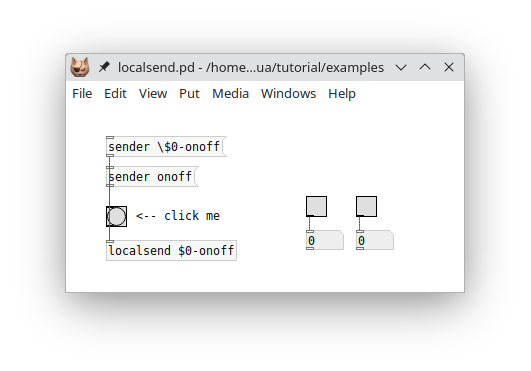

Try clicking on the `sender` messages in the patch and watch the symbol argument of the object change accordingly. Clicking the bang object labeled "click me" will then send the bang message to one of the two toggles on the right, depending on the `sender` message you clicked.

## Signals and graphics

So far all of our examples only did control processing, which is what Pd-Lua was originally designed for. But thanks to the work of Timothy Schoen (the creator and main developer of [plugdata](https://plugdata.org/)), as of version 0.12.0 Pd-Lua also provides facilities for audio signal processing and graphics. It goes without saying that these capabilities vastly extend the scope of Pd-Lua applications, as you can now program pretty much any kind of Pd object in Lua, covering both signal and control processing, as well as custom GUI objects. We'll first discuss how to write a signal processing (a.k.a. dsp) object in Pd-Lua, and then go on to show the implementation of a simple GUI object using the graphics API.

---

**NOTE:** As these features are still fairly new, some details of the implementation may still be subject to change in future Pd-Lua versions. Also, we can't cover all the details here, so we recommend having a look at the examples included in the Pd-Lua distribution. You can find these under pdlua/examples in the source or in the help browser. Specifically, check the sig-example folder for another example illustrating the use of signal inlets and outlets, and Benjamin Wesch's [osci3d~](https://github.com/ben-wes/scope3d-) which shows how to implement a 3d oscilloscope employing both signal processing and graphics.

---

### Signals

Enabling signal processing in a Pd-Lua object involves three ingredients:

1. **Adding signal inlets and outlets:** As before, this is done by setting the `inlets` and `outlets` member variables in the `initialize` method. But instead of setting each variable to just a number, you specify a *signature*, which is a table indicating the signal and control in- and outlets with the special `SIGNAL` and `DATA` values. The number of in- and outlets is then given by the size of these tables. Thus, e.g., you'd use `self.inlets = { SIGNAL, SIGNAL, DATA }` if you need two signal and one control data inlet, in that order. Note that a number as the value of `inlets` or `outlets` corresponds to a signature with just `DATA` values in it.
2. **Adding a dsp method:** This step is optional. The `dsp` method gets invoked whenever signal processing is turned on in Pd, passing two parameters: `samplerate` and `blocksize` (but see the note on multi-channel signals below for a third `nchannels` argument in Pd-Lua 0.12.20 and later). The former tells you about the sample rate (number of audio samples per second) Pd runs at, which will be useful if your object needs to translate time and frequency values from physical units (i.e., seconds, milliseconds, and Hz) to sample-based time and frequency values, so usually you want to store the given value in a member variable of your object. The latter specifies the block size, i.e., the number of samples Pd expects to be processed during each call of the `perform` method (see below). You only need to store that number if your object doesn't have any signal inlets, so that you know how many samples need to be generated. Otherwise the block size can also be inferred from the size of the `in` tables passed to the `perform` method. Adding the `dsp` method is optional. You only have to define it if the signal and control data processing in your object requires the `samplerate` and `blocksize` values, or if you need to be notified when dsp processing gets turned on or the signal processing chain changes for some other reason.
3. **Adding a perform method:** This method is where the actual signal processing happens. It receives blocks of signal data from the inlets through its arguments, where each block is represented as a Lua table containing floating point sample values. The method then needs to return a tuple of similar Lua tables with the blocks of signal data for each outlet. Note that the number of *arguments* of the method matches the number of signal *inlets*, while the number of *return values* corresponds to the number of signal *outlets*. The `perform` method is *not* optional; if your object outputs any signal data, the method needs to be implemented, otherwise you'll get a `perform: function should return a table` or similar error in the Pd console as soon as you turn on dsp processing.

---

**NOTE:** As of Pd-Lua 0.12.20, thanks to the work of Ben Wesch, Pd-Lua has support for Pd's multi-channel signals. This requires Pd 0.54 or later (all signals are single-channel in earlier Pd versions). Therefore, in Pd-Lua 0.12.20 and later, the `dsp` method receives a *third* argument, let's call it `nchannels`. This is a Lua table which tells you about the number of channels in the signal data for each inlet. This will be 1 for normal Pd signals, but if `nchannels[i] > 1`, then your `perform` method should be prepared to process that many channels worth of sample data (i.e., the `i`th table argument of `perform` will actually contain `nchannels[i] * blocksize` samples -- a block of `blocksize` samples for the first channel, followed by another block of `blocksize` samples for the second channel, etc.).

For the *output* signals, you can set up the desired number of channels per outlet in the `dsp` method, using the `signal_setmultiout` method which is also new in Pd-Lua 0.12.20. In that case your Lua table with the output samples should contain the `blocksize` samples for channel 1 followed by the `blocksize` samples for channel 2, etc., using the same layout as the tables for multi-channel input signals. We won't go into this here any further, but you can find a simple example for your perusal in the examples/multichannel folder.

---

In addition to the `dsp` and `perform` methods, your object may contain any number of methods doing the usual control data processing on the `DATA` inlets. It is also possible to receive control data on the `SIGNAL` inlets; however, you won't be able to receive `float` messages, because they will be interpreted as constant signals which get passed as blocks of signal data to the `perform` method instead.

#### Example 1: Mixing signals

Let's take a look at a few simple examples illustrating the kind of processing the `perform` method might do. First, let's mix two signals (stereo input) down to a single (mono) output by computing the average of corresponding samples. We need two signal inlets and one signal outlet, so our `initialize` method looks like this:

~~~lua
local foo = pd.Class:new():register("foo")

function foo:initialize(sel, atoms)
   self.inlets = {SIGNAL,SIGNAL}
   self.outlets = {SIGNAL}
   return true
end
~~~

And here's the `perform` method (in this simple example we don't need `foo:dsp()`):

~~~lua
function foo:perform(in1, in2)
   for i = 1, #in1 do
      in1[i] = (in1[i]+in2[i])/2
   end
   return in1
end
~~~

Note that here we replaced the signal data in the `in1` table with the result, so we simply return the modified `in1` signal; no need to create a third `out` table. (This is safe because it won't actually modify any signal data outside the Lua method.)

Easy enough. And this is how this object works in a little test patch:

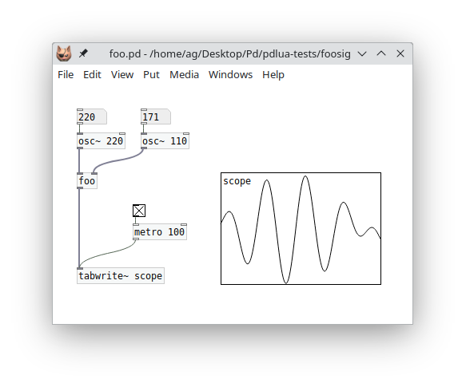

#### Example 2: Analyzing a signal

A dsp object can also have no signal outlets at all if you just want to process the incoming signal data in some way and output the result through a normal control outlet. E.g., here's one (rather simplistic) way to compute the rms ([root mean square](https://en.wikipedia.org/wiki/Root_mean_square)) envelope of a signal as control data:

~~~lua
function foo:initialize(sel, atoms)
   self.inlets = {SIGNAL}
   self.outlets = {DATA}
   return true
end

function foo:perform(in1)
   local rms = 0
   for i = 1, #in1 do
      rms = rms + in1[i]*in1[i]
   end
   rms = math.sqrt(rms/#in1)
   self:outlet(1, "float", {rms})
end
~~~

A little test patch:

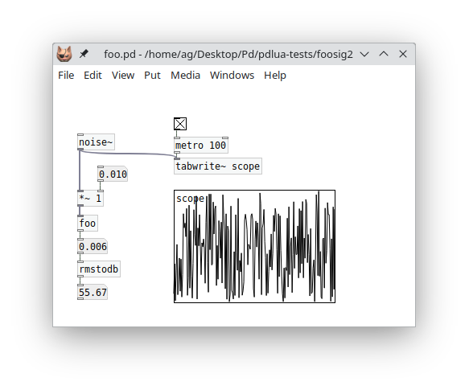

#### Example 3: Generating a signal

Conversely, we can also have an object which converts control inputs into signal data, such as this little oscillator object which produces a sine wave:

~~~lua
function foo:initialize(sel, atoms)
   self.inlets = {DATA}
   self.outlets = {SIGNAL}
   self.phase = 0
   self.freq = 220
   self.amp = 0.5
   return true
end

-- message to set frequency...
function foo:in_1_freq(atoms)
   self.freq = atoms[1]
end

-- ... and amplitude.
function foo:in_1_amp(atoms)
   self.amp = atoms[1]
end

function foo:perform()
   local freq = self.freq  -- frequency of the sine wave in Hz
   local amp = self.amp    -- amplitude of the sine wave (0 to 1)

   -- calculate the angular frequency (in radians per sample)
   local angular_freq = 2 * math.pi * freq / self.samplerate

   local out = {} -- result table
   for i = 1, self.blocksize do
      out[i] = amp * math.sin(self.phase)
      self.phase = self.phase + angular_freq
      if self.phase >= 2 * math.pi then
         self.phase = self.phase - 2 * math.pi
      end
   end

   return out
end
~~~

The obligatory test patch:

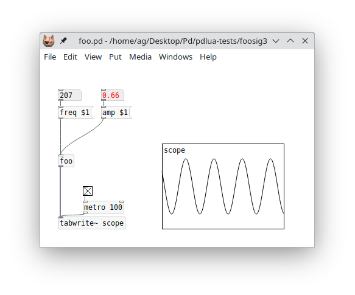

#### Real-world example: Cross-fades

Let's finally take a look at a somewhat more realistic and useful example which performs cross-fades on two incoming signals by doing linear interpolation between the input signals. A customary design for this kind of dsp object is to have a target cross-fade value (`xfade` argument) ranging from 0 (all left signal) to 1 (all right signal). We also want to be able to smoothly ramp from one cross-fade value to the next in order to avoid clicks (`time` argument), and have an initial delay until moving to the new xfade value (`delay` argument). Here is the definition of a `luaxfade~` object which does all this, including the checking of all argument values, so that we don't run into any Lua exceptions because of bad values. The example also illustrates how to receive control messages on a signal inlet (cf. the `fade` message on the left signal inlet). You can find this as luaxfade~.pd_lua in the tutorial examples.

~~~lua
local luaxfade = pd.Class:new():register("luaxfade~")

function luaxfade:initialize(sel, atoms)
   self.inlets = {SIGNAL,SIGNAL}
   self.outlets = {SIGNAL}
   self.xfade = 0
   self.xfade_to = 0
   self.xfade_time = 0
   self.xfade_delay = 0
   self.time = 0
   self.ramp = 0
   return true
end

function luaxfade:dsp(samplerate, blocksize)
   self.samplerate = samplerate
end

function luaxfade:in_1_fade(atoms)
   -- If self.samplerate is not initialized, because the dsp method has not
   -- been run yet, then we cannot compute the sample delay and ramp times
   -- below, so we bail out, telling the user to enable dsp first.
   if not self.samplerate then
      self:error("luaxfade~: unknown sample rate, please enable dsp first")
      return
   end
   local fade, time, delay = table.unpack(atoms)
   if type(delay) == "number" then
      -- delay time (msec -> samples)
      self.xfade_delay = math.floor(self.samplerate*delay/1000)
   end
   if type(time) == "number" then
      -- xfade time (msec -> samples)
      self.xfade_time = math.floor(self.samplerate*time/1000)
   end
   if type(fade) == "number" then
      -- new xfade value (clamp to 0-1)
      self.xfade_to = math.max(0, math.min(1, fade))
   end
   if self.xfade_to ~= self.xfade then
      -- start a new cycle
      if self.xfade_delay > 0 then
         self.time, self.ramp = self.xfade_delay, 0
      elseif self.xfade_time > 0 then
         self.time, self.ramp = self.xfade_time,
           (self.xfade_to-self.xfade)/self.xfade_time
      else
         self.xfade = self.xfade_to
         self.time, self.ramp = 0, 0
      end
   end
end

function luaxfade:perform(in1, in2)
   local xfade, xfade_to = self.xfade, self.xfade_to
   local xfade_time = self.xfade_time
   local time, ramp = self.time, self.ramp

   -- loop through each sample index
   for i = 1, #in1 do
      -- mix (we do this in-place, using in1 for output)
      in1[i] = in1[i]*(1-xfade) + in2[i]*xfade
      -- update the mix if time > 0 (sample countdown)
      if time > 0 then
         -- update cycle is still in ptogress
         if ramp ~= 0 then
            xfade = xfade + ramp
         end
         time = time - 1
      elseif xfade_to ~= xfade then
         if xfade_time > 0 then
            -- start the ramp up or down
            time, ramp = xfade_time, (xfade_to-xfade)/xfade_time
         else
            -- no xfade_time, jump to the new value immediately
            xfade = xfade_to
         end
      end
   end

   -- update internal state
   self.xfade, self.time, self.ramp = xfade, time, ramp

   -- return the mixed down sample data
   return in1
end
~~~

And here's the luaxfade.pd patch which takes a sine wave on the left and a noise signal on the right inlet and performs cross fades with a ramp time of 500 msec and an initial delay of 200 msec. To adjust these values, just edit the `fade` message accordingly.

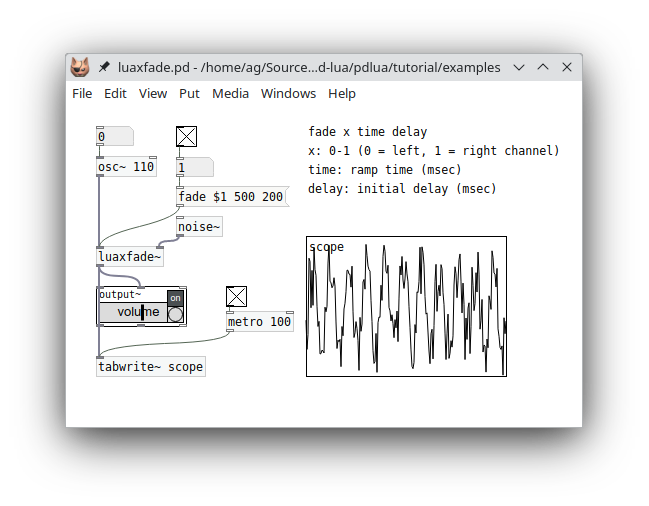

### Graphics

Timothy Schoen's Pd-Lua graphics API provides you with a way to equip an object with a static or animated graphical display inside its object box on the Pd canvas. Typical examples would be various kinds of wave displays, or custom GUI objects consisting of text and simple geometric shapes. To these ends, you can adjust the size of the object box to any width and height you specify. Inside the box rectangle you can then draw text and basic geometric shapes such as lines, rectangles, circles, and arbitrary paths, through stroke and fill operations using any rgb color.

In order to enable graphics in a Pd-Lua object, you have to provide a `paint` method. This receives a graphics context `g` as its argument, which lets you set the current color, and draw text and the various different geometric shapes using that color. In addition, you can provide methods to be called in response to mouse down, up, move, and drag actions on the object, which is useful to equip your custom GUI objects with mouse-based interaction.

Last but not least, the `set_args` method lets you store internal object state in the object's creation arguments, while `get_args` lets you retrieve those arguments. This is useful if you need to keep track of persistent state when storing an object on disk (via saving the patch) or when duplicating or copying objects. Also, their companion `canvas_realizedollar` method allows you to expand symbols containing "$" patch arguments like `$0`, `$1`, etc. These three are often combined, but they can also be used separately, and they work just as well with ordinary Pd-Lua objects which don't utilize the graphics API. In fact we've already introduced them while discussing receivers, see [Expanding dollar symbols](#expanding-dollar-symbols) above, so we won't go into them again; however, check the circle-gui example included in the distribution to see how to store Lua object configuration data persistently in the creation arguments of a custom GUI object.

We use a custom GUI object, a simple kind of dial, as a running example to illustrate most of these elements in the following subsections. To keep things simple, we will not discuss the graphics API in much detail here, so you may want to check the graphics subpatch in the main pdlua-help patch, which contains a detailed listing of all available methods for reference.

#### Getting started: A basic dial object

Let's begin with a basic clock-like dial: just a circular *face* and a border around it, on which we draw a *center point* and the *hand* (a line) starting at the center point and pointing in any direction which indicates the current *phase* angle. So this is what we are aiming for:

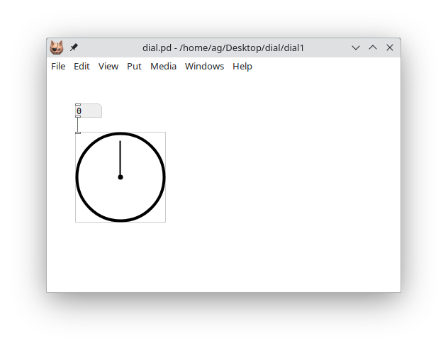

Following the clock paradigm, we assume that a zero phase angle means pointing upwards (towards the 12 o'clock position), while +1 or -1 indicates the 6 o'clock position, pointing downwards. Phase angles less than -1 or greater than +1 wrap around. Positive phase differences denote clockwise, negative differences counter-clockwise rotation. And since we'd like to change the phase angle displayed on the dial, we add an inlet taking float values.

Here's the code implementing the object initialization and the float inlet:

~~~lua
local dial = pd.Class:new():register("dial")

function dial:initialize(sel, atoms)
   self.inlets = 1
   self.outlets = 0
   self.phase = 0
   self:set_size(127, 127)
   return true
end

function dial:in_1_float(x)
   self.phase = x
   self:repaint()
end
~~~

The `self:set_size()` call in the `initialize` method sets the pixel size of the object rectangle on the canvas (in this case it's a square with a width and height of 127 pixels). Also note the call to `self:repaint()` in the float handler for the inlet, which will redraw the graphical representation after updating the phase value.

---

**NOTE:** We mention in passing that `self:repaint()` always redraws everything, in this example the face, border, center point, and hand, even though only the hand will change with the phase angle. As of Pd-Lua 0.12.19, it is also possible to partition your graphics into *layers*, each with their own paint method, so that you only need to repaint layers that actually changed, which will improve rendering performance for complex drawings. This is beyond the scope of this introduction, however, so you may want to check the graphics subpatch in the main pdlua-help patch for details and an example.

---

We still have to add the `dial:paint()` method to do all the actual drawing:

~~~lua
function dial:paint(g)
   local width, height = self:get_size()
   local x, y = self:tip()

   -- standard object border, fill with bg color
   g:set_color(0)
   g:fill_all()

   -- dial face
   g:fill_ellipse(2, 2, width - 4, height - 4)
   g:set_color(1)
   -- dial border
   g:stroke_ellipse(2, 2, width - 4, height - 4, 4)
   -- center point
   g:fill_ellipse(width/2 - 3.5, height/2 - 3.5, 7, 7)
   -- dial hand
   g:draw_line(x, y, width/2, height/2, 2)
end
~~~

The existence of the  `paint` method tells Pd-Lua that this is a graphical object. As mentioned before, this method receives a graphics context `g` as argument. The graphics context is an internal data structure keeping track of the graphics state of the object, which is used to invoke all the graphics operations. The `set_color` method of the graphics context is used to set the color for all drawing operations; in the case of `fill` operations it fills the graphical element with the color, while in the case of `stroke` operations it draws its border. There's just one color value, so we need to set the desired fill color in case of `fill`, and the desired stroke color in case of `stroke` operations. The color values 0 and 1 we use in this example are predefined, and indicate the default background color (usually white) and default foreground color (usually black), respectively.

It is possible to choose other colors by calling `g:set_color(r, g, b)` with rgb color values instead, with each r, g, b value ranging from 0 to 255 (i.e., a byte value). For instance, the color "teal" would be specified as 0, 128, 128, the color "orange" as 255, 165, 0, "black" as 0, 0, 0, "white" as 255, 255, 255, etc. It's also possible to add a fourth *alpha* a.k.a. opacity value a, which is a floating point number in the range 0-1, where 0 means fully transparent, 1 fully opaque, and any value in between will blend in whatever is behind the graphical element to varying degrees. As of Pd-Lua 0.12.7, alpha values are fully supported in both plugdata and purr-data. In vanilla Pd they are simply ignored at present, so all graphical objects will be opaque no matter what alpha value you specify.

Let's now take a closer look at the drawing operations themselves. We start out by filling the entire object rectangle, which is our drawing surface, with the default background color 0, using `g:fill_all()`. This operation is special in that it not only fills the entire object rectangle, but also creates a standard border rectangle around it. If you skip this, you'll get an object without border, which may be useful at times.

We then go on to fill a circle with the background color, the dial's face. The graphics API has no operation to draw a circle, so we just draw an ellipse instead. The coordinates given to `g:fill_ellipse()` are the coordinates of the rectangle surrounding the ellipse. In this case the width and height values are what we specified with `self:set_size(127, 127)` in the `initialize` method, so they are identical, and thus our ellipse is in fact a circle. Also note that we make the ellipse a little smaller and put it at a small offset from the upper left corner, so the actual width and height are reduced by 4 and the shape is centered in the object rectangle (or square, in this case).

Note that we could have skipped drawing the face entirely at this point, since it just draws a white circle on white background. But we could make the face a different color later, so it's good to include it anyway.

After the face we draw its border, drawing the same ellipse again, but this time in the default foreground color and with a stroke width of 4. We then go on to draw the remaining parts, a small disk in the center which mimics the shaft on which the single hand of the dial is mounted, and the hand itself, which is just a simple line pointing in a certain direction.

Which direction? I'm glad you asked. The line representing the hand goes from the center point width/2, height/2 to the point given by the x, y coordinates. Both width, height and x, y are calculated and assigned to local variables at the beginning of the `paint` method:

~~~lua
   local width, height = self:get_size()
   local x, y = self:tip()
~~~

The `get_size()`  call employs a built-in method which returns the current dimensions of the object rectangle; this is part of the graphics API. We could have used the constant 127 from the `initialize` method there, but we could change the size of the object rectangle later, so it's better not to hard-code the size in the `paint` method.

The `tip()` method we have to define ourselves. It is supposed to calculate the coordinates of the tip of the hand. I have factored this out into its own routine right away, so that we can reuse it later when we add the mouse actions. Here it is:

~~~lua
function dial:tip()
   local width, height = self:get_size()
   local x, y = math.sin(self.phase*math.pi), -math.cos(self.phase*math.pi)
   x, y = (x/2*0.8+0.5)*width, (y/2*0.8+0.5)*height
   return x, y
end
~~~

This basically just converts the position of the tip from polar coordinates (1, phase) to rectangular coordinates (x, y) and then translates and scales the normalized coordinates to pixel coordinates in the object rectangle which has its center at (width/2, height/2). We also put the tip at a normalized radius of 0.8 so that it is well within the face of the dial. Moreover, the formula computing the x, y pair accounts for the fact that the y coordinates of the object rectangle are upside-down (0 is at the top), and that we want the center-up (a.k.a. 12 o'clock) position to correspond to a zero phase angle. Hence the sin and cos terms have been swapped and the cos term adorned with a minus sign compared to the standard polar - rectangular conversion formula.

So now that we hopefully understand all the bits and pieces, here's the Lua code of the object in its entirety again:

~~~lua
local dial = pd.Class:new():register("dial")

function dial:initialize(sel, atoms)
   self.inlets = 1
   self.outlets = 0
   self.phase = 0
   self:set_size(127, 127)
   return true
end

function dial:in_1_float(x)
   self.phase = x
   self:repaint()
end

-- calculate the x, y position of the tip of the hand
function dial:tip()
   local width, height = self:get_size()
   local x, y = math.sin(self.phase*math.pi), -math.cos(self.phase*math.pi)
   x, y = (x/2*0.8+0.5)*width, (y/2*0.8+0.5)*height
   return x, y
end

function dial:paint(g)
   local width, height = self:get_size()
   local x, y = self:tip()

   -- standard object border, fill with bg color
   g:set_color(0)
   g:fill_all()

   -- dial face
   g:fill_ellipse(2, 2, width - 4, height - 4)
   g:set_color(1)
   -- dial border
   g:stroke_ellipse(2, 2, width - 4, height - 4, 4)
   -- center point
   g:fill_ellipse(width/2 - 3.5, height/2 - 3.5, 7, 7)
   -- dial hand
   g:draw_line(x, y, width/2, height/2, 2)
end
~~~

#### Adding an outlet

We can already send phase values into our dial object, but there's no way to get them out again. So let's add an outlet which lets us do that. Now that the grunt work is already done, this is rather straightforward. First we need to add the outlet in the `initialize` method:

~~~lua
   self.outlets = 1
~~~

And then we just add a message handler for `bang` which outputs the value on the outlet:

~~~lua
function dial:in_1_bang()
   self:outlet(1, "float", {self.phase})
end
~~~

Easy as pie. Here's how our patch looks like now:

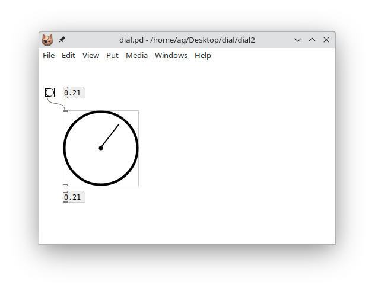

#### Mouse actions

Our dial now has all the basic ingredients, but it still lacks one important piece: Interacting with the graphical representation itself using the mouse. The graphics API makes this reasonably easy since it provides us with four callback methods that we can implement. Each of these gets invoked with the current mouse coordinates relative to the object rectangle:

- `mouse_down(x, y)`: called when the mouse is clicked
- `mouse_up(x, y)`: called when the mouse button is released
- `mouse_move(x, y)`: called when the mouse changes position while the mouse button is *not* pressed
- `mouse_drag(x, y)`: called when the mouse changes position while the mouse button *is* pressed

Here we only need the `mouse_down` and `mouse_drag` methods which let us keep track of mouse drags in the object rectangle in order to update the phase value and recalculate the tip of the hand (I told you that the `tip()` method would come in handy again!). Here's the Lua code. Note that the `mouse_down` callback is used to initialize the `tip_x` and `tip_y` member variables, which we keep track of during the drag operation, so that we can detect in `mouse_drag` when it's time to output the phase value and repaint the object:

~~~lua
function dial:mouse_down(x, y)
   self.tip_x, self.tip_y = self:tip()
end

function dial:mouse_drag(x, y)
   local width, height = self:get_size()

   local x1, y1 = x/width-0.5, y/height-0.5
   -- calculate the normalized phase, shifted by 0.5, since we want zero to be
   -- the center up position
   local phase = math.atan(y1, x1)/math.pi + 0.5
   -- renormalize if we get an angle > 1, to account for the phase shift
   if phase > 1 then
      phase = phase - 2
   end

   self.phase = phase

   local tip_x, tip_y = self:tip();

   if tip_x ~= self.tip_x or tip_y ~= self.tip_y then
      self.tip_x = tip_x
      self.tip_y = tip_y
      self:in_1_bang()
      self:repaint()
   end
end
~~~

And here's the same patch again, which now lets us drag the hand to change the phase value:

#### More dial action: clocks and speedometers

Now that our dial object is basically finished, let's do something interesting with it. The most obvious thing is to just turn it into a clock (albeit one with just a seconds hand) counting off the seconds. For that we just need to add a metro object which increments the phase angle and sends the value to the dial each second:

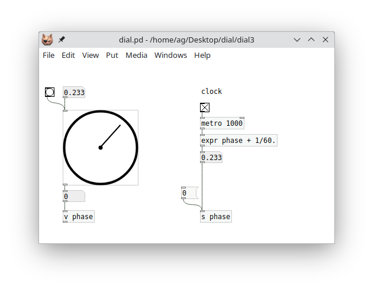

Pd lets us store the phase angle in a named variable (`v phase`) which can be recalled in an `expr` object doing the necessary calculations. The `expr` object sends the computed value to the `phase` receiver, which updates both the variable and the upper numbox, and the numbox then updates the dial. Note that we also set the variable whenever the dial outputs a new value, so you can also drag around the hand to determine the starting phase. And we added a `0` message to reset the hand to the 12 o'clock home position when needed.

Here's another little example, rather useless but fun, simulating a speedometer which just randomly moves the needle left and right:

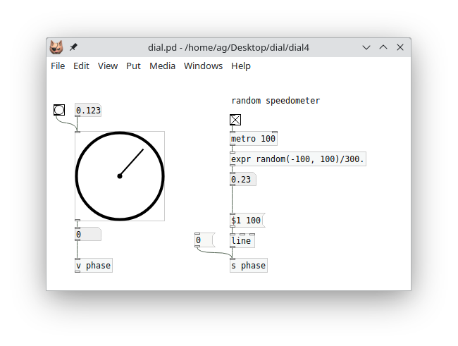

I'm sure you can imagine many more creative uses for this simple but surprisingly versatile little GUI object, which we did in just a few lines of fairly simple Lua code. Have fun with it! An extended version of this object, which covers some more features of the graphics API that we didn't discuss here to keep things simple, can be found as dial.pd and dial.pd_lua in the tutorial examples:

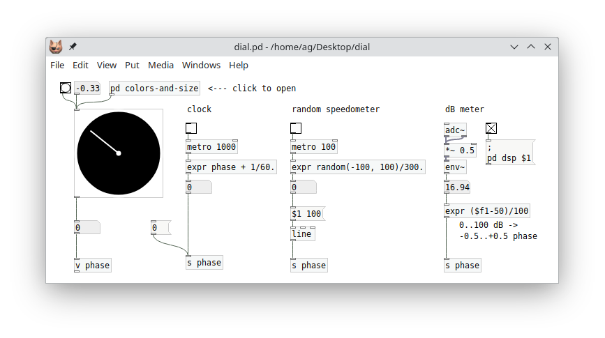

The extended example adds messages for resizing the object and setting colors, and also shows how to save and restore object state in the creation arguments using the `set_args()` method mentioned at the beginning of this section. The accompanying patch covers all the examples we discussed here, and adds a third example showing how to utilize our dial object as a dB meter.

## Live coding

I've been telling you all along that in order to make Pd-Lua pick up changes you made to your .pd_lua files, you have to relaunch Pd and reload your patches. Well, as you probably guessed by now, this isn't actually true. So in this section we are going to cover Pd-Lua's *live coding* features, which let you modify your sources and have Pd-Lua reload them on the fly, without ever exiting the Pd environment. This rapid incremental style of development is one of the hallmark features of dynamic interactive programming environments like Pd and Lua. Musicians also like to employ it to modify their programs live on stage, which is where the term "live coding" comes from.

I've kept this topic for the final section of this guide, because it is somewhat advanced, and there are several different (traditional and new) methods available which differ in capabilities and ease of use. However, in modern Pd-Lua versions there *is* one preferred method which rules them all, so if you want to cut to the chase as quickly as possible, then feel free to just skip ahead to the [pdx.lua](#pdx.lua) section now.

If you're still here, then you probably want to learn about the other methods, too. So in the following we first describe the predefined Pd-Lua object classes `pdlua` and `pdluax`, so that you know the "traditional" live-coding instruments that Pd-Lua had on offer for a long time. We also discuss how to add a `reload` message to your existing object definitions. This is quite easy to do by directly employing Pd-Lua's `dofile` function, which is also what both `pdlua` and `pdluax` use internally.

These methods all work with pretty much any Pd-Lua version out there, but require a little bit of setup which can get time-consuming and error-prone if you're dealing with large patches involving a lot of different Lua objects.

That's why Pd-Lua nowadays includes an extension module called *pdx.lua* that "just works" out of the box and automatizes everything, so that you only have to put a simple `reload` message in your main patch and be done with it. This is also the method we recommend, to novices and expert users alike. We describe it last so that you can also gather a good understanding of Pd-Lua's traditional live coding methods, and learn to appreciate them. These are still used in many older scripts, and Pd-Lua will continue to support them for backward compatibility.

### pdlua

The `pdlua` object accepts a single kind of message of the form `load filename` on its single inlet, which causes the given Lua file to be loaded and executed. Since `pdlua` has no outlets, its uses are rather limited. However, it does enable you to load global Lua definitions and execute an arbitrary number of statements, e.g., to post some text to the console or transmit messages to Pd receivers using the corresponding Pd-Lua functions. For instance, here's a little Lua script loadtest.lua which simply increments a global `counter` variable (first initializing it to zero if the variable doesn't exist yet) and posts its current value in the console:

~~~lua
counter = counter and counter + 1 or 0
pd.post(string.format("loadtest: counter = %d", counter))
~~~

To run this Lua code in Pd, you just need to connect the message `load loadtest.lua` to `pdlua`'s inlet (note that you really need to specify the full filename here, there's no default suffix):

Now, each time you click on the `load loadtest.lua` message, the file is reloaded and executed, resulting in some output in the console, e.g.:

~~~
loadtest: counter = 0
loadtest: counter = 1
~~~

Also, you can edit the script between invocations and the new code will be loaded and used immediately. E.g., if you change `counter + 1` to `counter - 1`, you'll get:

~~~
loadtest: counter = 0
loadtest: counter = -1
~~~

That's about all there is to say about `pdlua`; it's a very simple object.

### pdluax

`pdluax` is a bit more elaborate and allows you to create real Pd-Lua objects with an arbitrary number of inlets, outlets, and methods. To these ends, it takes a single creation argument, the basename of a .pd_luax file. This file is a Lua script returning a function to be executed in `pdluax`'s own `initialize` method, which contains all the usual definitions, including the object's method definitions, in its body. This function receives the object's `self` as well as all the extra arguments `pdluax` was invoked with, and should return `true` if creation of the object succeeded.

For instance, here's a simplified version of our `foo` counter object, rewritten as a .pd_luax file, to be named foo.pd_luax:

~~~lua
return function (self, sel, atoms)
   self.inlets = 1
   self.outlets = 1
   self.counter = type(atoms[1]) == "number" and atoms[1] or 0
   self.step = type(atoms[2]) == "number" and atoms[2] or 1
   function self:in_1_bang()
      self:outlet(1, "float", {self.counter})
      self.counter = self.counter + self.step
   end
   return true
end
~~~

Note the colon syntax `self:in_1_bang()`. This adds the bang method directly to the `self` object rather than its class, which is `pdluax`. (We obviously don't want to modify the class itself, which may be used to create any number of different kinds of objects, each with their own collection of methods.) Also note that the outer function is "anonymous" (nameless) here; you can name it, but there's usually no need to do that, because this function will be executed just once, when the corresponding `pdluax` object is created. Another interesting point to mention here is that this approach of including all the object's method definitions in its initialization method works with regular .pd_lua objects, too; try it!

In the patch, we invoke a .pd_luax object by specifying the basename of its script file  as `pdluax`'s first argument, adding any additional creation arguments that the object itself might need:

These `pdluax foo` objects work just the same as their regular `foo` counterparts, but there's an important difference: The code in foo.pd_luax is loaded *every time* you create a new `pdluax foo` object. Thus you can easily modify that file and just add a new `pdluax foo` object to have it run the latest version of your code. For instance, in foo.pd_luax take the line that reads:

~~~lua
      self.counter = self.counter + self.step
~~~

Now change that `+` operator to `-`:

~~~lua
      self.counter = self.counter - self.step
~~~

Don't forget to save your edits, then go back to the patch and recreate the `pdluax foo` object on the left. The quickest way to do that is to just delete the object, then use Pd's "Undo" operation, Ctrl+Z. Et voilà: the new object now decrements the counter rather than incrementing it. Also note that the other object on the right still runs the old code which increments the counter; thus you will have to give that object the same treatment if you want to update it, too.

While `pdluax` was considered Pd-Lua's main workhorse for live coding in the past, it has its quirks. Most notably, the syntax is different from regular object definitions, so you have to change the code if you want to turn it into a .pd_lua file. Also, having to recreate an object to reload the script file is quite disruptive (it resets the internal state of the object), and may leave objects in an inconsistent state (different objects may use various different versions of the same script file). Sometimes this may be what you want, but it makes `pdluax` somewhat difficult to use. It's not really tailored for interactive development, but it shines if you need a specialized tool for changing your objects on a whim in a live situation.

Fortunately, if you're not content with Pd-Lua's traditional facilities for live coding, it's easy to roll your own using the internal `dofile` method, which is discussed in the next subsection.

### dofile and dofilex

So let's discuss how to use `dofile` in a direct fashion. Actually, we're going to use its companion `dofilex` here, which works the same as `dofile`, but loads Lua code relative to the "externdir" of the class (the directory of the .pd_lua file) rather than the directory of the Pd canvas with the pdlua object, which is what `dofile` does. Normally, this won't make much of a difference, but it *will* matter if Lua class names are specified using relative pathnames, such as `../foo` or `bar/baz`. Since we're reloading class definitions here, it's better to use `dofilex` so that our objects don't break if we move things about.

The method we sketch out below is really simple and doesn't have any of the drawbacks of the `pdluax` object, but you still have to add a small amount of boilerplate code to your existing object definition. Here is how `dofilex` is invoked:

- `self:dofilex(scriptname)`: This loads the given Lua script, like Lua's `loadfile`, but also performs a search on Pd's path to locate the file, and finally executes the file if it was loaded successfully. Note that `self` must be a valid Pd-Lua object, which is used solely to determine the externdir of the object's class, so that the script will be found if it is located there.

The return values of `dofilex` are those of the Lua script, along with the path under which the script was found. If the script itself returns no value, then only the path will be returned. (We don't use any of this information in what follows, but it may be useful in more elaborate schemes. For instance, `pdluax` uses the returned function to initialize the object, and the path in setting up the object's actual script name.)

Of course, `dofilex` needs the name of the script file to be loaded. We could hardcode this as a string literal, but it's easier to just ask the object itself for this information. Each Pd-Lua object has a number of private member variables, among them `_name` (which is the name under which the object class was registered) and `_scriptname` (which is the name of the corresponding script file, usually this is just `_name` with the `.pd_lua` extension tacked onto it). The latter is what we need. Pd-Lua also offers a `whoami()` method for this purpose, but that method just returns `_scriptname` if it is set, or `_name` otherwise. Regular Pd-Lua objects always have `_scriptname` set, so it will do for our purposes.

Finally, we need to decide how to invoke `dofilex` in our object. The easiest way to do this is to just add a message handler (i.e., an inlet method) to the object. For instance, say that the object is named `foo` which is defined in the foo.pd_lua script. Then all you have to do is add something like the following definition to the script:

~~~lua
function foo:in_1_reload()
   self:dofilex(self._scriptname)
end
~~~

As we already discussed, this code uses the object's internal `_scriptname` variable, and so is completely generic. You can just copy this over to any .pd_lua file, if you replace the `foo` prefix with whatever the name of your actual class variable is. With that definition added, you can now just send the object a `reload` message whenever you want to have its script file reloaded.

---

**NOTE:** This works because the `pd.Class:new():register("foo")` call of the object only registers a new class if that object class doesn't exist yet; otherwise it just returns the existing class.

By reloading the script file, all of the object's method definitions will be overwritten, not only for the object receiving the `reload` message, but for *all* objects of the same class, so it's sufficient to send the message to any (rather than every) object of the class. Also, existing object state (as embodied by the internal member variables of each object) will be preserved.

In general all this works pretty well, but there are some caveats, too. Note that if you *delete* one of the object's methods, or change its name, the old method will still hang around in the runtime class definition until you relaunch Pd. That's because reloading the script does not erase any old method definitions, it merely replaces existing and adds new ones.

Finally, keep in mind that reloading the script file does *not* re-execute the `initialize` method. This method is only invoked when an object is instantiated. Thus, in particular, reloading the file won't change the number of inlets and outlets of an existing object. Newly created objects *will* pick up the changes in `initialize`, though, and have the proper number of inlets and outlets if those member variables were changed.

---

Let's give this a try, using luatab.pd_lua from the "Using arrays and tables" section as an example. In fact, that's a perfect showcase for live coding, since we want to be able to change the definition of the waveform function `f` in `luatab:in_1_float` on the fly. Just add the following code to the end of luatab.pd_lua:

~~~lua
function luatab:in_1_reload()
   self:dofilex(self._scriptname)
end
~~~

Now launch the luatab.pd patch and connect a `reload` message to the `luatab wave` object, like so:

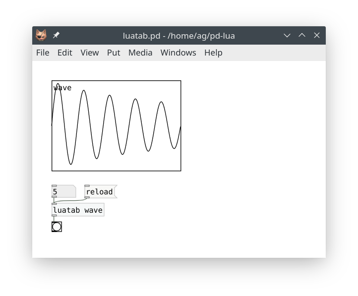

Next change the wavetable function to whatever you want, e.g.:

~~~lua
      local function f(x)
         return math.sin(2*math.pi*freq*x)+1/3*math.sin(2*math.pi*3*freq*x)
      end
~~~

Return to the patch, click the `reload` message, and finally reenter the frequency value, so that the waveform gets updated:

### pdx.lua

The method sketched out in the preceding subsection works well enough for simple patches. However, having to manually wire up the `reload` message to one object of each class that you're editing is still quite cumbersome. In a big patch, which is being changed all the time, this quickly becomes unwieldy. Wouldn't it be nice if we could equip each object with a special receiver, so that we can just click a message somewhere in the patch to reload a given class, or even all Pd-Lua objects at once? Or even send that message via the `pdsend` program, e.g., from the text editor in which you edit the Lua source of your object?

Well, all this is in fact possible, but the implementation is a bit too involved to fully present here. So we have provided this in a separate pdx.lua module, which you can find in the sources accompanying this tutorial for your perusal. As of Pd-Lua 0.12.8, pdx.lua is pre-loaded and all the required setup is performed automatically. You only have to add a message like the following to your patch, which goes to the special `pdluax` receiver (note that this is unrelated to the `pdluax` object discussed previously, it just incidentally uses the same name):

~~~
; pdluax reload
~~~

When clicked, this just reloads all Pd-Lua objects in the patch. You can also specify the class to be reloaded (the receiver matches this against each object's class name):

~~~
; pdluax reload foo
~~~

Or maybe name several classes, like so:

~~~
; pdluax reload foo, reload bar
~~~

You get the idea. Getting set up for remote control via `pdsend` isn't much harder. E.g., let's say that we use UDP port 4711 on localhost for communicating with Pd, then you just need to connect `netreceive 4711 1` to the `pdluax` receiver in a suitable way. Let's use the luatab.pd_lua object from the previous subsection as an example. You can remove the `in_1_reload` handler from that script -- it's no longer needed, as pdx.lua now dispatches the `reload` messages for us. Here's how the revised patch looks like:

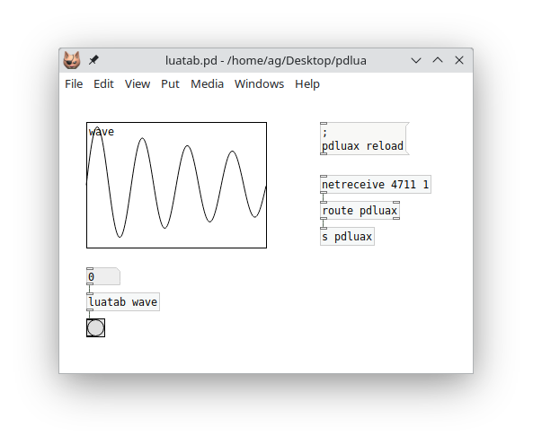

This doesn't look any simpler than before, but it also does a whole lot more. Clicking the message not just reloads the `luatab` script, but *any* Lua object you have running, in *any* of the patches you have opened. And you can now use `pdsend 4711 localhost udp` to reload your Lua objects from literally anywhere. Any decent code editor will let you bind a keyboard command which does this for you. Myself, I'm a die-hard Emacs fan, so I've included a little elisp module *pd-remote.el* which shows how to do this. Once you've added this to your .emacs, you can just type Ctrl+C Ctrl+K in any Lua buffer to make Pd reload your Lua scripts after editing them. It doesn't get much easier than that.

In addition, I've provided a little abstraction named *pd-remote.pd* which takes care of adding the `netreceive` and messaging bits and also looks much tidier in your patches. Using the abstraction is easy: Insert `pd-remote` into the patch you're working on, and (optionally) connect a `pdluax reload` message (without the `;` prefix) to the inlet of the abstraction; or use something like `pdluax reload foo` to reload a specific object class. Now you can just click on that message to reload your script files, and the abstraction will also respond to such messages on port 4711 (the port number can be changed in the abstraction if needed). Here's how that looks like in a patch:

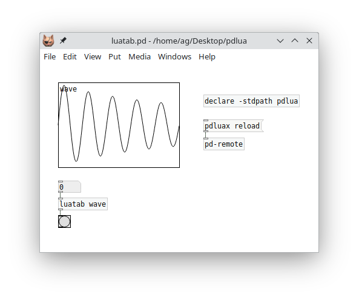

---

**NOTE:** To make Pd find the pd-remote.pd abstraction without having to copy it to your project directory, you can add the pdlua external directory (which is where the abstraction gets installed) to your Pd library path, either in your Pd setup, or inside the patch with a `declare -stdpath` object, as shown above.

The pd-remote.el file can be installed in your Emacs site-lisp directory if needed. However, the easiest way to install it is from [MELPA](https://melpa.org/), a large repository of Emacs packages. Please also check the [pd-remote](https://github.com/agraef/pd-remote) repository on GitHub for the latest pd-remote version and further details. This also includes a pointer to a Visual Studio Code extension written by Baris Altun which can be used as a replacement for pd-remote.el if you prefer VS Code for editing.

---

And here's a little gif showing the above patch in action. You may want to watch this in [Typora](https://www.typora.io/) or your favorite web browser to make the animation work.

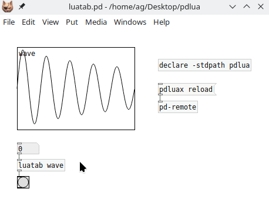

So there you have it: Not one, not two, but three different ways to live-code with Pd-Lua (or four, if you count in the `pdlua` object). pdx.lua certainly is the most advanced and user-friendly solution among these, but you can choose whatever best fits your purpose and is the most convenient for you.

### Object reinitialization in pdx.lua

If pdx.lua reloads a script file, it normally does *not* run the `initialize` method. This is by design, as we want the reload process to be as smooth as possible while running a patch, and invoking the `initialize` method could potentially be quite disruptive, as it usually reinitializes all your member variables.

However, pdx.lua has another trick up its sleeve if you do need some kind of custom reinitialization. There are two callback methods that you can implement, `prereload` and `postreload` which will be invoked immediately before and after reloading the script file, respectively.  Either method can be used to reinitialize your objects during reloading in any desired way. The only difference between the two methods is that `prereload` still runs in the old script, while `postreload` executes the new code which has just been loaded. Typically you'd use `prereload` to perform any required bookkeeping or state-saving before the script gets loaded, and `postreload` for custom initialization afterwards.

In particular, these callbacks can change any member variables, either directly or by invoking other methods. The most important use cases probably are to change the `inlets` and `outlets` variables, and to add a `paint` method, which can be done on the fly to reconfigure your objects accordingly. To these ends, you can just call the `initialize` method from `postreload`. To demonstrate this, in the tutorial examples you'll find a pdxtest.pd patch and pdxtest~.pd_lua script. The script has the following `reload` method:

~~~lua
function pdxtest:postreload()
   -- stuff to do post-reload goes here
   pd.post("Reloaded!")
   -- instead of doing a full initialization, you could also just change the
   -- number of inlets and outlets here
   self:initialize()
end
~~~

Now, if you need to change the number of inlets and outlets of the object, you can just modify the definitions of `inlets` and `outlets` in the script's `initialize` method and reload. Easy as pie. Try it! Instructions can be found in the script.

### Live coding and dsp

One caveat about using any of the above live-coding solutions in conjunction with Pd-Lua's [signal processing capabilities](#signals) is in order. When the Lua code of an object class gets reloaded, the existing code is replaced immediately. There isn't any kind of automatic "cross-fade" between old and new code. If you change the `perform` method of that class, there may well be discontinuities in the generated output signals which result in audible clicks. This won't matter much if you're just developing an object in your studio. But live on stage you may want to avoid this -- unless you accept or even cherish such glitches as part of your live performance.

There are ways to work around this issue, however. To demonstrate this, the tutorial examples include the following live-xfade.pd patch:

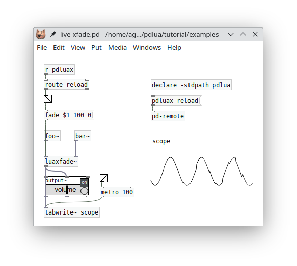

The `foo~` and `bar~` objects in this example are essentially the same, with some minor variations in the sound generation parameters. The particular sounds in this example are not important, each object just outputs a random walk of sine waves of varying frequencies with some phase distortion. But they *will* produce clicks when switching them abruptly, thus we need a smooth cross-fade between the two sound sources. This is handled by the [`luaxfade~`](#real-world-example-cross-fades) object from the Signals section.

What's special here is that the transitions are being triggered automatically, *by the received reload messages*. By these means, you can edit, say, the `foo~` object while the `bar~` object is playing, then save your edits and send a `reload` message. At this point the new code for `foo~` is loaded while the cross-fade from `bar~` to `foo~` is initiated at the same time.

This method obviously requires some preparation and diligence when being used live on stage. Having some kind of automatic cross-fade functionality for dsp objects baked into Pd-Lua's run-time system would make this a lot easier. Maybe this can be provided by pdx.lua in a future release.

## Conclusion

Congratulations! If you made it this far, you should have learned more than enough to start using Pd-Lua successfully for your own projects. You should also be able to read and understand the many examples in the Pd-Lua distribution, which illustrate all the various features in much more detail than we could muster in this introduction. You can find these in the examples folder, both in the Pd-Lua sources and the pdlua folder of your Pd installation.

The examples accompanying this tutorial (including the pdx.lua, pdlua-remote.el and pdlua-remote.pd files mentioned at the end of the pdx.lua section) are also available for your perusal in the examples subdirectory of the folder where you found this document.

Finally, I'd like to thank Claude Heiland-Allen for creating such an amazing tool, it makes programming Pd externals really easy and fun. Kudos also to Roberto Ierusalimschy for Lua, which for me is one of the best-designed, easiest to learn, and most capable multi-paradigm scripting languages there are today, while also being fast, simple, and light-weight.